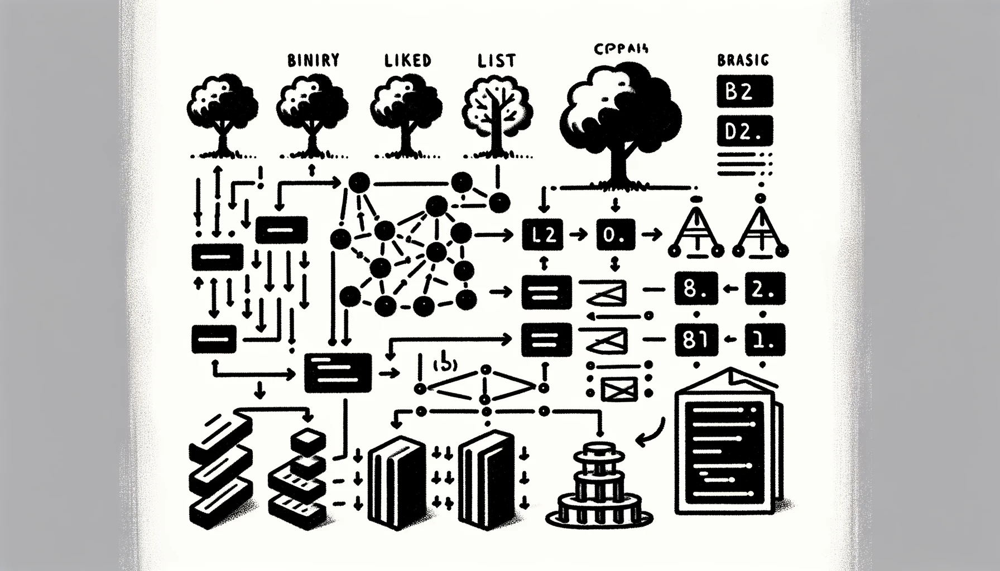

# Алгоритмы и структуры данных на TypeScript

В этом репозитории содержатся примеры популярных алгоритмов, структур данных и паттернов проектирования на языке Typescript. Для каждого алгоритма и
структуры данных есть свой файл README.md с соответствующими пояснениями и ссылками на материалы для дальнейшего
изучения (в том числе и ссылки на видеоролики в YouTube).

## Структуры данных

**Структура данных (англ. data structure)** — программная единица, позволяющая хранить и обрабатывать множество однотипных и/или логически
связанных данных в вычислительной технике. Для добавления, поиска, изменения и удаления данных структура данных предоставляет некоторый
набор функций, составляющих её интерфейс.

`A` - Базовый уровень, `B` - Продвинутый уровень

* `A` Связный список
* `A` Двусвязный список
* `A` Очередь
* `A` Стек
* `A` Хэш-таблица
* `B` Деревья

## Алгоритмы

**Алгоритмы** - это наборы команд, способствующие эффективному программированию. Они объясняют, как сортировать записи, искать элементы,
рассчитывать числовые значения, находить кратчайший путь между двумя точками на карте, определять максимально возможный поток
информации по сети и т.д.

`A` - Базовый уровень, `B` - Продвинутый уровень

### Алгоритмы поиска
  * `A` Линейный поиск
  * `A` Двоичный поиск

### Алгоритмы сортировки
  * `A` Сортировка пузырьком
  * `A` Сортировка выбором
  * `A` Сортировка вставками
  * `B` Сортировка слиянием
  * `B` Быстрая сортировка
  * `B` Сортировка подсчётом

### Связный список
  * `A` Прямой обход
  * `A` Обратный обход

### Деревья
  * `A` Поиск в глубину
  * `A` Поиск в ширину

### Графы
  * `A` Поиск в глубину
  * `A` Поиск в ширину

## Паттерны проектирования

**Паттерн проектирования** - это часто встречающееся решение определённой проблемы при проектировании архитектуры программ.
В отличие от готовых функций или библиотек, паттерн нельзя просто взять и скопировать в программу. Паттерн представляет собой
не какой-то конкретный код, а общую концепцию решения той или иной проблемы, которую еще нужно подстроить под нужды вашей программы.

`A` - Базовый уровень, `B` - Продвинутый уровень

### Порождающие паттерны
  * `A` Одиночка (Singleton)
  * `A` Прототип (Prototype)
  * `A` Фабричный метод (Factory Method)
  * `B` Строитель (Builder)
  * `B` Абстрактная фабрика (Abstract Factory)

### Структурные паттерны
  * `A` Адаптер (Adapter)
  * `A` Фасад (Facade)
  * `B` Мост (Bridge)
  * `B` Заместитель (Proxy)
  * `B` Компоновщик (Composite)
  * `B` Декоратор (Decorator)

### Поведенческие паттерны
  * `A` Состояние (State)
  * `A` Команда (Command)
  * `A` Стратегия (Strategy)
  * `B` Итератор (Iterator)
  * `B` Посредник (Mediator)
  * `B` Наблюдатель (Observer)
  * `B` Цепочка обязанностей (Chain of Responsibility)
